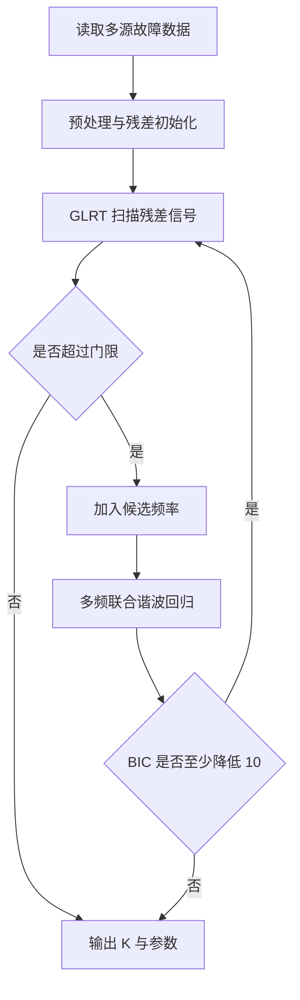

# 第三问论文材料：多故障源分离与定位

## 1. 问题建模

第三问要求从单通道混合信号中自动分离多个潜在故障频率，并估计各分量的振幅和初相。沿用前两问的结论，将观测信号写为

$$
x(t_n)=\sum_{k=1}^{K} A_k\sin(2\pi f_k t_n+\phi_k)+w(t_n),\quad n=1,\ldots,N,
$$

其中 $K$ 为未知故障源个数，$f_k$ 为第 $k$ 个故障特征频率，$A_k$ 与 $\phi_k$ 分别为振幅和初相，$w(t_n)$ 表示噪声。目标是在未知 $K$ 的情况下估计

$$
\{K,(f_k,A_k,\phi_k)_{k=1}^{K}\}.
$$

本题数据为单通道观测，因此当两个源完全同频或相位近似抵消时，只能观测到正弦矢量和，不能唯一分解成两个独立源。这一限制是单通道模型的理论边界。

## 2. 算法流程

第三问主模型由三部分组成：

1. 多峰 GLRT：从残差信号中搜索候选周期分量。
2. BIC 自动定阶：判断新增频率是否值得保留。
3. 多频联合谐波回归：同时估计全部频率、振幅和初相。

顺序检测流程如下：

对频率集合 $\boldsymbol f=(f_1,\ldots,f_K)$，构造设计矩阵

$$
\mathbf X(\boldsymbol f)=
\begin{bmatrix}
\sin(2\pi f_1t_1)&\cos(2\pi f_1t_1)&\cdots&\sin(2\pi f_Kt_1)&\cos(2\pi f_Kt_1)\\
\vdots&\vdots&&\vdots&\vdots\\
\sin(2\pi f_1t_N)&\cos(2\pi f_1t_N)&\cdots&\sin(2\pi f_Kt_N)&\cos(2\pi f_Kt_N)
\end{bmatrix}.
$$

给定频率后，线性系数由最小二乘估计：

$$
\hat{\boldsymbol\beta}=\arg\min_{\boldsymbol\beta}\|\mathbf y-\mathbf X(\boldsymbol f)\boldsymbol\beta\|_2^2.
$$

程序使用 SVD 求解最小二乘，不显式计算正规方程的逆。频率参数再通过局部非线性优化精修。得到正弦、余弦系数 $b_k,c_k$ 后，振幅和初相为

$$
\hat A_k=\sqrt{b_k^2+c_k^2},\qquad
\hat\phi_k=\operatorname{atan2}(c_k,b_k).
$$

模型选择采用 BIC：

$$
\mathrm{BIC}=N\ln(\mathrm{SSE}/N)+p\ln N,
$$

其中 $\mathrm{SSE}$ 为残差平方和，$p$ 为模型参数个数。新增分量只有在 GLRT 通过门限且 BIC 至少降低 10 时才保留。

## 3. 近频处理

当两个故障频率非常接近时，单纯多峰搜索容易把弱分量漏掉。为提高近频辨识能力，程序对疑似近频簇使用局部增强流程：

1. 在局部频带内用细网格定位最强分量。
2. 临时剥离最强分量。
3. 在残差中搜索弱峰。
4. 将强峰、残差弱峰和自适应分裂频率作为候选初值。
5. 回到二源联合非线性拟合。
6. 用条件 GLRT、BIC、秩和条件数共同判断是否拆成两个源。

剥离只用于生成弱分量初值，最终频率、振幅和相位仍来自联合拟合。该流程不要求两个频率关于某个固定中心对称。

## 4. 真实数据结果

以 `q3_multisource_separation_results_optimized` 为当前正式结果目录，程序自动识别出 4 个故障分量，频率约为 `4, 8, 13, 14 Hz`。

| 分量 | 频率/Hz | 振幅 | 初相位/rad | 分量 SNR/dB |
|---:|---:|---:|---:|---:|
| 1 | 3.999998174 | 0.019103 | 1.371555 | -17.378 |
| 2 | 7.999928571 | 0.024889 | -2.989028 | -15.080 |
| 3 | 13.000088885 | 0.010503 | -2.157736 | -22.574 |
| 4 | 14.000023485 | 0.040053 | 0.112468 | -10.947 |

联合模型解释方差为 `11.92%`，残差标准差为 `0.099880`。设计矩阵条件数为 1，说明真实数据四个频率之间不存在数值病态。

## 5. SNR 仿真验证

使用已知真值的多源正弦叠加模型构造仿真数据，重复次数为 200。总 SNR 定义为全部正弦分量功率之和与噪声功率之比。

| 总 SNR/dB | 重复次数 | K 识别正确率 | 95% 区间 | 条件频率 MAE/Hz | 条件振幅误差 | 条件相位 MAE/rad |
|---:|---:|---:|---:|---:|---:|---:|
| -20 | 200 | 1.5% | [0.5%, 4.3%] | 0.00019302 | 21.287% | 0.19264 |
| -15 | 200 | 76.0% | [69.6%, 81.4%] | 7.90368e-05 | 6.023% | 0.119234 |
| -12 | 200 | 98.0% | [95.0%, 99.2%] | 6.00303e-05 | 4.459% | 0.0864753 |
| -10 | 200 | 100.0% | [98.1%, 100.0%] | 4.9939e-05 | 3.492% | 0.0695316 |
| -5 | 200 | 100.0% | [98.1%, 100.0%] | 2.65817e-05 | 2.002% | 0.0388814 |

结果表明，算法在 `-12 dB` 及以上能稳定识别故障源个数并估计参数；`-15 dB` 附近处于过渡区；`-20 dB` 下检测能力明显下降。纯噪声顺序检测的经验误报率为 `0.20%`。

## 6. 近频辨识极限

近频辨识成功要求：自动识别两个分量，且两个频率误差均不超过真实间隔的四分之一。经验辨识极限定义为成功率达到 90% 并在更大间隔持续不低于 90% 的最小间隔。

| 振幅条件 | 经验辨识极限 | 关键结果 |
|---|---:|---|
| 等幅近频 | 约 0.002 Hz | 间隔 0.002 Hz 时成功率 93.5%，间隔 0.0025 Hz 时成功率 100.0% |
| 不等幅近频 | 约 0.003 Hz | 间隔 0.0025 Hz 时成功率 80.0%，间隔 0.003 Hz 时成功率 97.5% |

MUSIC 作为高分辨率对照，在较大间隔时表现良好，但在不等幅近频场景下明显弱于主模型。例如不等幅 `0.003 Hz` 时，主模型成功率为 `97.5%`，MUSIC 成功率为 `47.0%`。

FFT 频点间隔 $1/T=0.0025$ Hz 不是参数估计的绝对下限。联合参数模型可以在有利 SNR 下实现超分辨率，但当频率继续接近时，设计矩阵逐渐病态，识别成功率会下降。

## 7. 极端工况边界

极端工况用于说明模型适用边界，不用于调参。

| 工况 | 成功率 | 平均估计阶数 | 说明 |
|---|---:|---:|---|
| very_low_snr_-25 | 0.0% | 1.17 | 极低 SNR 下无法稳定识别全部源 |
| very_low_snr_-30 | 0.0% | 0.13 | 检测统计量基本被噪声主导 |
| non_symmetric_close | 100.0% | 2.00 | 非对称近频可以稳定拆分 |
| identical_frequency | 100.0% | 1.00 | 成功标准为不误拆；完全同频单通道不可唯一分解 |
| phase_cancellation | 100.0% | 1.00 | 成功标准为不误拆；相消会降低可观测能量 |
| overcomplete_k8 | 100.0% | 8.00 | 多源数量增加时仍可识别，但计算量上升 |
| impulsive_noise | 100.0% | 4.00 | 当前脉冲噪声设定下结果稳定 |
| low_frequency_boundary | 100.0% | 2.00 | 低频边界稳定 |
| high_frequency_boundary | 100.0% | 2.00 | 高频边界稳定 |

完全同频和相消不是算法失败，而是单通道观测条件下的信息不足。这个结论也说明第四问引入多传感器布局具有必要性。

## 8. 结论表述

第三问最终可表述为：

本文将第一问的 GLRT 检测扩展为多峰顺序检测，并结合第二问的谐波回归构造多频联合参数估计模型。算法通过 GLRT 控制候选频率的误报，通过 BIC 自动确定故障源数量，通过联合最小二乘估计各源的振幅和初相。对近频故障，进一步采用残差复检、条件 GLRT 和二源联合重拟合提高弱分量检出能力。真实数据中自动识别出约 `4, 8, 13, 14 Hz` 四个故障频率；仿真实验表明，在 `-12 dB` 及以上 SNR 下多源识别稳定，纯噪声误报率约为 `0.20%`。近频实验表明，等幅场景经验辨识极限约为 `0.002 Hz`，不等幅场景约为 `0.003 Hz`。当两个源完全同频或相位强抵消时，单通道信号不具备唯一分解条件，应借助多传感器布局或额外先验提高可辨识性。

Hessian 频率区间仅作为局部线性化不确定性诊断，未经过 Bootstrap 校准，不能称为严格的 95% 置信区间。
